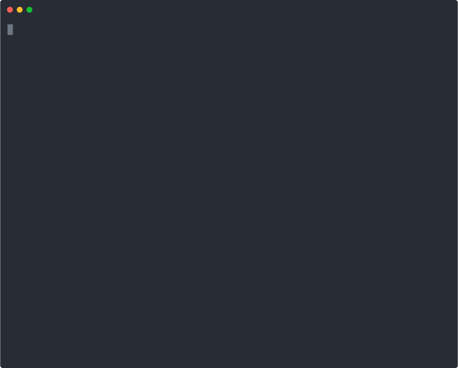

# Databricks Lakebridge Reconcile

Skill and test suite for [Lakebridge Reconcile](https://databrickslabs.github.io/lakebridge/docs/reconcile/) — validating data migrations from Snowflake, Oracle, SQL Server, and Synapse to Databricks Unity Catalog.

<p align="center">
  
</p>

---

## What Is Lakebridge Reconcile?

[Lakebridge Reconcile](https://databrickslabs.github.io/lakebridge/docs/reconcile/) compares source and target tables after a migration, checking:

- **Schema** — column names, data types, structural differences
- **Row counts** — missing rows in source or target
- **Data values** — column-level mismatches with configurable thresholds
- **Aggregates** — SUM, COUNT, AVG across grouped dimensions

The skill teaches an AI assistant how to generate the correct YAML configs (`reconcile.yml`, `recon_config.yml`) and Python notebooks to run reconciliation on Databricks.

---

## Repository Structure

```
├── databricks-skills/
│   └── databricks-lakebridge-reconcile/   # The skill (SKILL.md + reference docs)
├── specs/
│   └── databricks-lakebridge-reconcile/   # Specification and test spec
├── .test/
│   ├── tests/tier1/lakebridge_reconcile/  # Tier 1 tests (LLM agent loop)
│   ├── skills/databricks-lakebridge-reconcile/  # Ground truth test data
│   ├── demos/                             # Asciicast demo recordings
│   ├── src/skill_test/                    # Test framework library
│   └── scripts/                           # Evaluation scripts
└── README.md
```

---

## Quick Start

### Prerequisites

- Python 3.10+
- [uv](https://github.com/astral-sh/uv) package manager
- Databricks workspace with Claude Sonnet endpoint (`databricks-claude-sonnet-4-6`)
- `DATABRICKS_HOST` and `DATABRICKS_TOKEN` in `.env` or environment

### Run Tier 1 Tests

The tier 1 tests exercise the skill via a multi-turn LLM agent loop with mock Databricks tools backed by DuckDB + SQLGlot:

```bash
cd .test
uv run --extra tier1 --extra dev python -m pytest tests/tier1/ -m tier1 -v
```

**12 tests** covering:
- **Tests 1–6**: Config generation (Snowflake, column mapping, thresholds, schema-only, filtered MSSQL, aggregates)
- **Tests 7–9**: Notebook code generation (Snowflake, JDBC/Oracle, Databricks-to-Databricks)
- **Tests 10–12**: Result interpretation (overall status, missing rows, column mismatches)

### Run Ground Truth Evaluation

Static validation of skill examples (YAML/Python syntax, import resolution):

```bash
cd .test
uv run python scripts/run_eval.py databricks-lakebridge-reconcile
```

### Play the Demo

```bash
asciinema play .test/demos/lakebridge_config_generation.cast
```

---

## The Skill

The skill lives in [`databricks-skills/databricks-lakebridge-reconcile/`](databricks-skills/databricks-lakebridge-reconcile/) and consists of:

| File | Purpose |
|------|---------|
| `SKILL.md` | Main skill instructions and usage patterns |
| `configuration.md` | YAML config schema reference (reconcile.yml, recon_config.yml) |
| `examples.md` | Worked examples for common scenarios |
| `secret_scopes.md` | Secret scope setup per source platform |

Supported source platforms: **Snowflake**, **Oracle**, **SQL Server (MSSQL)**, **Synapse**, **Databricks** (Hive metastore → Unity Catalog).

---

## Testing Architecture

### Tier 1 — LLM Agent Loop Tests

Real LLM calls to Claude Sonnet on Databricks Foundation Model API, with mock tools:

- **DuckDB** — in-memory database seeded with source, target, and reconciliation output tables
- **SQLGlot** — transpiles Databricks SQL → DuckDB dialect for local execution
- **Mock tools** — `execute_sql`, `list_secrets`, `connect_to_workspace`, etc.
- **OpenAI-compatible client** — talks to Databricks FMAPI serving endpoint

### Ground Truth — Offline Evaluation

YAML-based test cases validated locally (syntax, imports, structure) via the `skill-test` framework.

---

## License

(c) 2026 Databricks, Inc. All rights reserved.

The source in this project is provided subject to the [Databricks License](https://databricks.com/db-license-source). See [LICENSE.md](LICENSE.md) for details.
